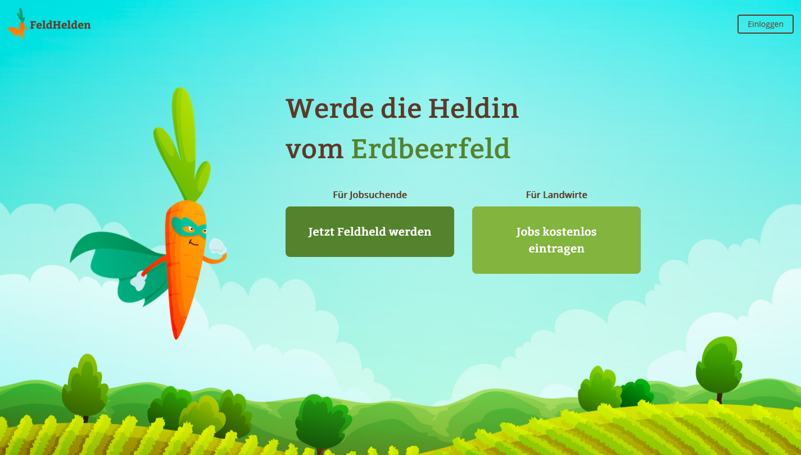
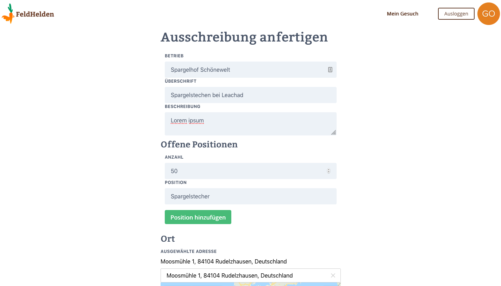
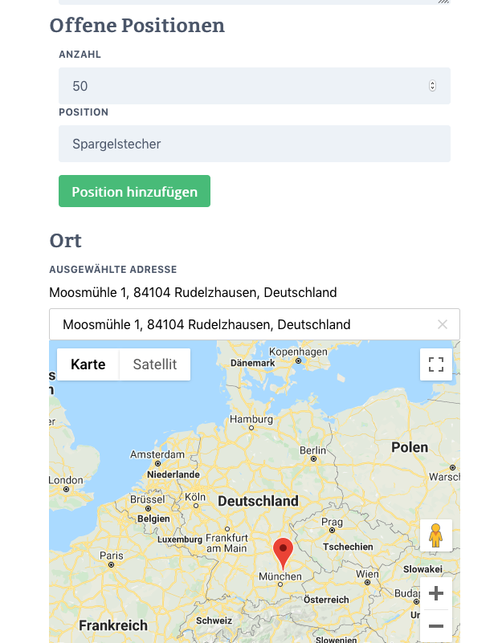

# FeldHelden

This tool was conceived as part of [WirVsVirus Hackathon](https://wirvsvirushackathon.org/) to organize seasonal workers for agriculture in the wake of the COVID-19 pandemic.

It aims to supplement the usual workforce, that might likely not be able to travel from surounding countries with students and other workers willing to help out.

## Capabilities

- Farmers and workers can create profiles containing their contact data
- Farmers can create job offers, outlining the work to be done and required amount of workers
- Workers can apply to open job offers and track their application status
- Farmers can view open applications and accept/decline them

## Screenshots

## Tools used

- Cloudflare Workers + Workers Sites - Serverless hosting
- Auth0 - Authentication as a Service
- FaunaDB - Database with GraphQL capabilities
- Google Maps + Algolia + Algolia Places - Geosearch & Map display
- React, TailwindCSS, FontAwesome

## License

All code is licensed under the MIT license. Some of the media assets might require additional licenses.
